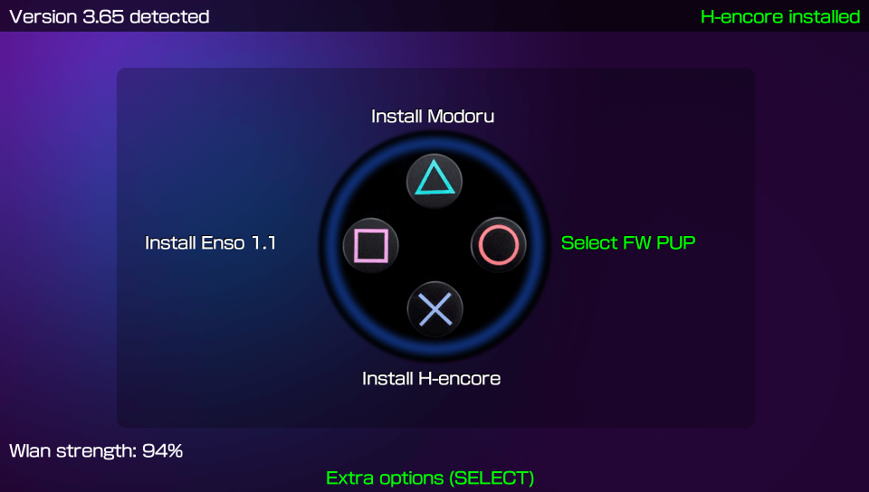
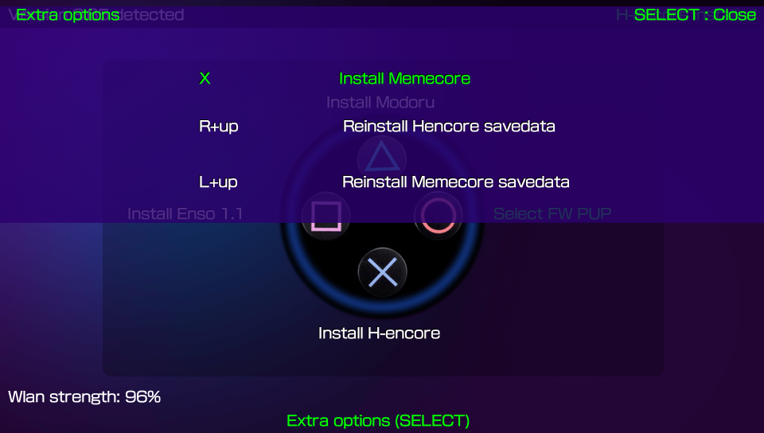

# Easy Downgrader/Updater for PS Vita (Formerly 365 U/D H)
**Downgrade/Update your PS Vita the easy way without a PC.**

### Description ###
This simple app will help you install/download the nedeed apps and files to get your PS Vita updated/Downgraded to your FW selection between 3 to choose from (3.60,3.65 or 3.68).

## IMPORTANT ##
**This app was created for people without access to any PC, or for those who want to do the whole process right on the PS Vita.**

### Easy Downgrader/Updater for PS Vita Current Version: 1.01 ###

### Instructions ###
1. **To be able to install and use this app you must have either Trinity, H-encore or Henkaku installed**

2. After taking care of step 1, now you can think of what FW suits you best.

### Changelog 1.01 ###

- App name changed to Easy Downgrader/Updater for PS Vita. 
- Added install Modoru, if not found, when FW PUP is chosen. 
- Added Download FW PUP screen, 3 to choose from. 
- Added option to cancel download. 
- Added savedata personalization. 
- Cleaned code a bit. 

### Changelog 1.0 ###
- Warning screens right at the start :). 
- Ability to install H-encore, Modoru, Enso v1.1 (Main). 
- Ability to download 3.65 PUP and move it to Modoru (Main). 
- Ability to install Memecore (3.60 users). 
- Ability to reinstall Memecore/H-encore savedata (3.60 users). 

### NOTE: ###

**Easy Downgrader/Updater for PS Vita is packed with English and Spanish lang files.**

If you like to add any other language feel free to upload the .txt to this repo or contact us:

- Gdljjrod (https://twitter.com/gdljjrod).
- BaltazaR4 (https://twitter.com/baltazarregala4).

Remember to only translate the text between "".

## Controls:  ##

*Main Menu*

For warning screens!!: Please read them, thats why we put them in there!! :).

- **O:** FW Download scetion, choose the desired FW PUP and press "X" to start downloading. 
- **Triangle:** Install Modoru. 
- **Square:** Install Enso v1.1. 
- **X:** Install H-encore. 
- **Select:** Extra Options. 

*Extra Options*

- **X:** Install Memecore (3.60 users who want to stay there). 
- **R + UP:** Reinstall H-encore savedata. 
- **L + UP:** Reinstall Memecore savedata. 

### NOTE: ###
**Memecore is recommended for 3.60 only, for 3.65 or above you must use H-encore except for 3.69-70.
(After installing H-encore/Memecore, this app will restart your PS Vita and DB will be updated, No changes to bubble layout).**

## How to use this app? ##

*To Install 3.65 Enso on your console*

To Update from 3.60 or Downgrade from 3.67, 3.68, 3.69, 3.70 to 3.65 with Enso do as follows: 
1. Make sure your battery is 70% or over (50% recommended by Modoru). 
2. Press Circle and select 3.65 UPDATE (this will also install Modoru if not found). 
3. Press Square to install Enso v1.1 App. 
4. Press Cross to install H-encore (only if you are in 3.60 so you can have H-encore installed once you Update). 
5. After the PS Vita restart, reactivate HEN if you have to, Disable all plugins and restart again (you can use autoplugin to do so or reset taihen config.txt). 
6. Once the PS Vita has restarted, reactivate HEN if you have to, launch Modoru and follow the instructions. 
7. After the Downgrade/Update process is done, reactivate HEN, launch Enso v1.1 and follow the instructions. 

If everything went as planned... Congrats!! now you have a 3.65Enso PS Vita.

*To Go back to 3.60 from higher versions and Enso it*

1. Make sure your battery is 70% or over (50% recommended by Modoru). 
2. Press Circle and select 3.60 UPDATE (this will also install Modoru if not found). 
3. Press Square to install Enso v1.1 App. 
4. Press Cross to install Memecore (only if you want to go back to 3.60 so you can have Memecore installed once you Downgrade). 
5. After the PS Vita restart, reactivate HEN if you have to, Disable all plugins and restart again (you can use autoplugin to do so or reset taihen config.txt). 
6. Once the PS Vita has restarted, reactivate HEN if you have to, launch Modoru and follow the instructions. 
7. After the Downgrade/Update process is done, reactivate HEN, launch Enso v1.1 and follow the instructions. 

If everything went as planned... Congrats!! now you have a Ensoed 3.60 PS Vita.

*To Go to 3.68 from higher or lower versions*

1. Make sure your battery is 70% or over (50% recommended by Modoru). 
2. Press Circle and select 3.68 UPDATE (this will also install Modoru if not found). 
3. Press Cross to install H-encore (only if you want to update from 3.60 or downgrade from 3.69, .70 so you can have H-encore installed when the process is finished). 
4. After the PS Vita restart, reactivate HEN if you have to, Disable all plugins and restart again (you can use autoplugin to do so or reset taihen config.txt). 
5. Once the PS Vita has restarted, reactivate HEN if you have to, launch Modoru and follow the instructions. 

If bla bla bla planned... Congrats!! bla bla bla 3.68 PS Vita XD.

## Extra stuff this app can do ##

I think I mentioned it already but this is just a reminder :). 
1. Install H-encore if you are on 3.60, 3.69, 3.70 without a pc if you want to go up or down to 3.65 (you must have Henkaku or Trinity to be able to do so). 
2. Install Memecore if you are on 3.65, 3.67, 3.68, 3.69, 3.70 without a pc if you want to go down to 3.60 (you must have H-encore or Trinity to be able to do so). 
3. Personalize H-encore/Memecore savedata (no trophy warning message when launching). 
4. Shrink H-encore size below 10mb if the full size bubble is found. 

### Credits ###
- TheFloW for his great work and amazing apps.
- Onelua Team for support and help with this project.
- TutoProPlay for testing and videos.
- Gdljjrod for changes to original app :).

## Donation ##
In case you want to support the work of the team on the vita, you can always donate for some coffee. Any amount is highly appreciated:

